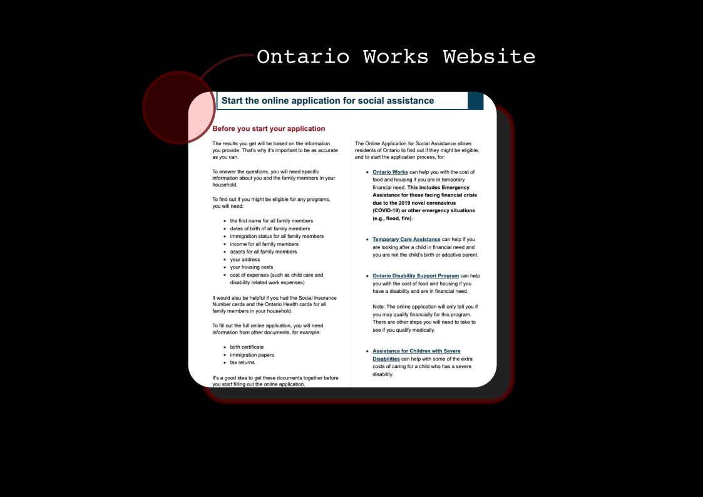

---
# Metadata
title: "Chalmers Cards"
type: ""

# Thumbnails
thumbnail: "./thumbnail.svg"

# Options
path: "/chalmerscards/"
order: 2
---

<article role="article">

Chalmers Cards are wooden information booklets that are designed to be given out at Toronto's emergency shelters and to folks sleeping on the streets of Toronto. They explain how to access social services!

Chalmers Cards are laser-cut onto wood so the information doesn't get crumpled or damaged. Plus the cars nice and people think they're cool so the cards don't get lost!

More than 1000 chalmers cards have been given distributed to folks in need!

</article>

<article role="article">

Toronto's social services infrastructure and documentation on social services are complicated. 

</article>

<article role="article">

Even information *intended* to be public facing is often difficult to find in the labryinth-like websites of social services such as Ontario Works. 

</article>

<article role="article">

During our research and testing, we spoke with many folks experiencing homelessness who described themselves as computer illiterate. Those who were familiar with computers said that they had their computer stolen recently. Others said they didn't have access to a computer every day. A lot of social services documentation is available on the internet. But getting on the internet is a real chore when you don't own a computer.

</article>

<article role="article">

Chalmers Cards are intended to be a to-the-point social services reference guide. Most of it's resources are toll free 24-hour phone numbers. The resources are organized into reasonable categories: 

    - health
    - financial-aid
    - shelter
    - legal-aid 
    - general-reference

</article>
<article role="article">

A workflow for getting financial aid is broken out into a three step process, each with a clear action item. All of this is neatly packaged in a 70mm by 70mm laser-cut wooden booklet that snaps on with a clip.

</article>

<article role="article">

Chalmers Cards materials are inexpensive and the cards are designed to be manufactured at makerspaces around Toronto.

Like all other Chalmers' projects, Chalmers Cards are open source and freely available from our github. Check them out here. If you have access to a lasercutter consider cutting some out and distributing them yourself! Or consider donating to have some cards produced.

</article>

