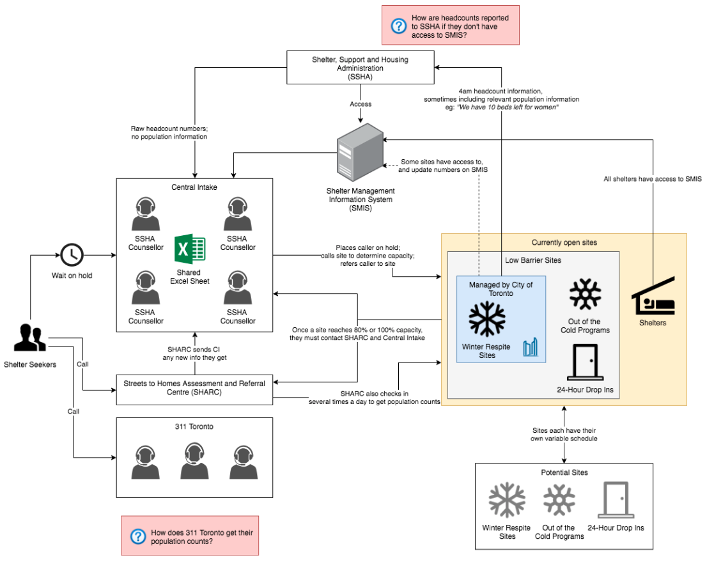

---
# Metadata
title: "Chalmers Signal"
type: ""

# Thumbnails
thumbnail: "./thumbnail.svg"

# Options
path: "/chalmerssignal/"
order: 1
---

<article role="article">

The Chalmers Signal hopes to make shelter occupancy data more accessible and faster to communicate among shelters in Toronto. It is an internet connected device that publishes real-time occupancy data amongst shelters around Toronto!

</article>

<article role="article">

The data from Chalmers Signals is consolidated into a live map at map.chalmerscards.com that shows at a glance which shelters have space, and how much, and which are full up.

</article>

<article role="article">

The intention of the Chalmers Signal is to make shelter referrals as fast as possible. With today's shelter technology, referrals are a slow and largely manual process requiring lots of phone calls and a complicated computer program called the Shelter Management Information System (SMIS).

</article>

<article role="article">

Every shelter performs headcount of clients multiple times per day (at some shelters multiple times an hour). However shelter occupancy numbers are often not published in SMIS more than once per day, usually late at night, because SMIS is slow to use.

> The barrier to fast and accurate shelter referrals lies **not** with the shelter staff but with the equipment that they are stuck with.

</article>

<article role="article">

Updating the Chalmers Signal only requires the turn of a knob! 

</article>

<article role="article">

Unlike SMIS, updating your shelter's occupancy is straighforward and only takes seconds. Shelter staff simply adjust the occupancy by rotating the knob each time they count their number of clients. 

Just like that, you’ve let the other shelters know how much space your site has left. The Chalmers Signal's screen will change to the new occupancy number, its case will change color, its computer will immediately update an online public database with the new occupancy number.

</article>

<article role="article">

The Chalmers Map shows the occupancy numbers of all the shelters in Toronto with Chalmers Signals. The Map's interface is designed so anyone can see, in real time, which shelters have space with a brief glance

> By quickly browsing the Chalmers Map, a shelter staff member will only need to make a single call to reach a shelter that is likely to have space.

Interested in knowing more? Or do you work at a shelter and are interested in getting a chalmers signal for your location? Please reach out to us at <a href="mailto:info@chalmers.cards">info@chalmers.cards </a>!

</article>

